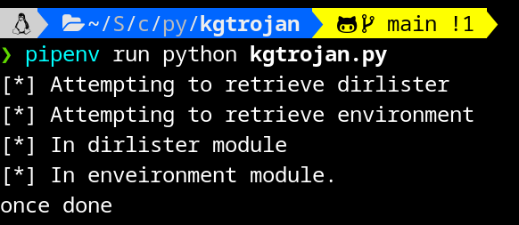
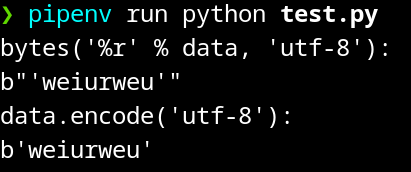

# 简介
本次写了一个基于github的C&C木马框架，在任何远程主机运行该入口文件后，可以自动完成指定的各种木马行为（尚待补充），并将数据自动存储在本库中    
# 使用
`pipenv run python kgtrojan.py`  
  
  
# 技术回顾
## pipenv
首次对python项目使用虚拟环境，因为安装github3包时遇到了依赖的版本冲突，这里记录一下基本的使用方式  
### 主要使用方式
如果我新得到该项目文件，进入虚拟环境文件夹，运行下列命令：
`pipenv sync `: 安装所有Pipfile.lock中包和依赖
会根据Pipfile.lock中的配置自动安装第三方库和所需要的依赖。因为在虚拟环境中，所以该依赖不会与其他项目中的依赖产生冲突。  

### Pipfile vs Pipfile.lock
二者属于一体两面。Pipfile是包和依赖的抽象依赖声明，而Pipfile.lock记录了最终安装的包和依赖的哈希值，用于最终导入包和依赖。  

### 其他命令
- `pipenv install`: 自动创建一个虚拟环境   
- `pipenv install <package>`: 安装指定包，并将包和依赖的信息更新进Pipfile和Pipfile.lock   
- `pipenv sync`: 根据Pipfile.lock的内容更新依赖项   
- `pipenv lock`: 根据Pipfile的手动添加的内容更新Pipfile.lock   
- `pipenv shell`: 进入虚拟环境  
- `exit`  
- `pipenv graph`: 查看已安装的库  
- `pipenv run python xxx.py`  
- `pipenv update`: 从Pipfile中更新所有内容到Pipfile.lock，并更新的环境中。（相当与`pipenv lock`+`pipenv sync`）    
  
## 自定义import
- module： 一个python object,常常对应一个.py文件。module是一个python级别的概念（保存在内存里），而.py文件是一个操作系统级别的概念。通过import，可以从一个操作系统级别的文件里生成一个python级别的module。  
- package： 一种特殊的module，常常对应一个文件夹。不同之处在于，当我们`import package`时，python会查看该文件夹下是否有`__init__.py`文件，有的话则运行该文件，没的话则什么都不运行。    
- `sys.path` vs `sys.meta_path`: `sys.meta_path` 是一个元类列表，用于查找模块。在导入模块时，Python 解释器首先会按照 `sys.meta_path` 中的顺序调用每个元类的 `find_module()` 方法来查找该模块。如果找到了对应的模块，就会调用对应元类的 `load_module()` 方法来加载该模块。如果没有找到对应的模块，则会继续查找下一个元类，直到所有的元类都被尝试过为止。相比之下，sys.path 是一个包含字符串路径的列表，这些路径表示 Python 解释器查找模块的搜索路径。当我们导入模块时，解释器会按照 sys.path 中的路径从左到右进行搜索，直到找到对应的模块或搜索完所有路径为止。  

## bytes('%r' % data, 'utf-8')
与`encode('utf-8')`不同之处在于，%r会将data转化为一个字符串，该格式的字符串包含了原始值的完整表达式，比如字符串会带上引号  


## importlib库
本次使用该库完成了`load_module`的主要功能，从而实现了：import时，当本地没有对应的module时，从外部找到并加载对应module   
```python
# spec，意为规范。loader为None，python解释器会使用默认的loader
spec = importlib.util.spec_from_loader(name, loader=None, origin=self.connection.git_url)

new_module = importlib.util.module_from_spec(spec)

# exec，第一个参数代表要执行的代码，第二个参数代表执行结果存储的位置
# module.__dict__，该参数代表对应模块的符号表信息。符号表信息就是名称到对象的映射，也就是说，我们在此处执行对应模块的代码的同时，将这些符号表信息也在对应模块中创建
exec(self.current_module_code, new_module.__dict__)
```

## github3.py库
这是本次主要依赖的库，通过登录github后获取仓库对象，使用仓库对象的各种函数完成了远程读取文件内容`repo.file_contents().content`，远程创建文件`repo.create_file(path, message, content)`

